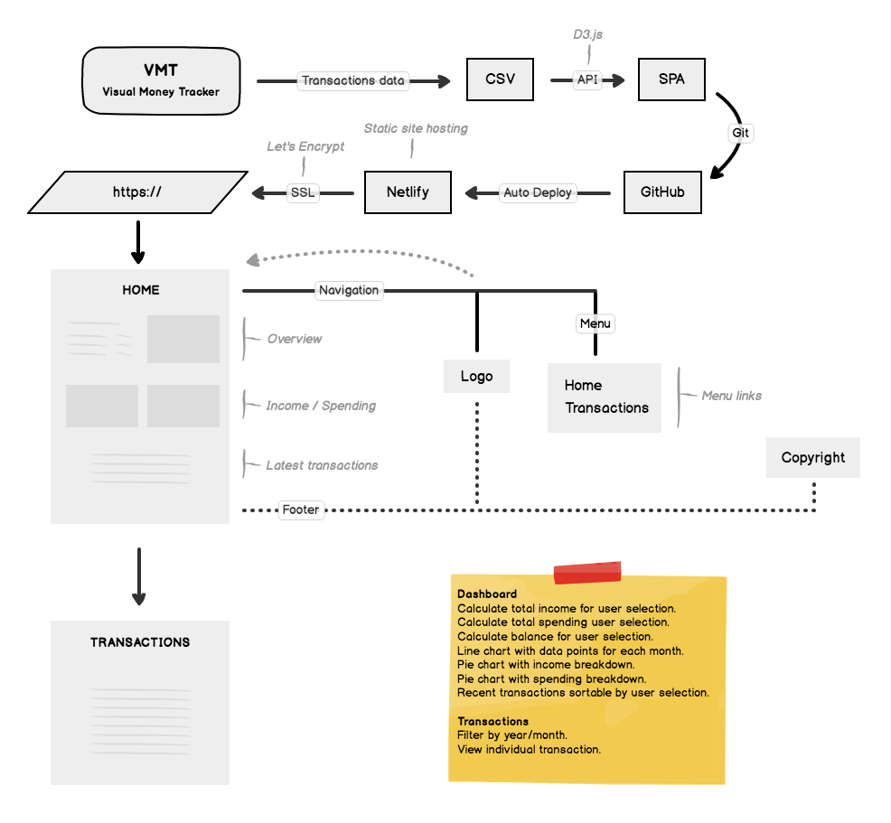

# Visual Money Tracker

A data dashboard application to visualise personal income and spending.

[Live Preview](https://elastic-hawking-05c821.netlify.com/)

## UX

An overview data dashboard with charts and list of transactions to visualise and track the money flow.

To learn more about the needs of the user, please read the [Project Brief](ux/Project_Brief.md) document.

#### Objectives

- Display a breakdown of totals
- Compare income vs spending
- Sort the transactions
- Calculate and display the balance

### Users

- Personal user

### Stories

---

**_(1) - "As a user, I want to navigate around the app, so that, I can access the sections I need."_**

- As a user, I want to navigate to main page, so that, I can see the dashboard.
  - [x] Add logo with hyperlink to home page.
  - [x] Add menu hyperlink to home page.
- As a user, I want to navigate to transactions page, so that, I can see the list of transactions.
  - [x] Add menu hyperlink to transactions page.

---

**_(2) - "As a user, I want to see a breakdown of transactions, so that, I can see total income, spending and balance at once."_**

- As a user, I want to see the section title, so that, I know the overview timeframe.
  - [x] Add section heading.
- As a user, I want to see my income total, so that, I can see how much I earned.
  - [x] Add item name.
  - [ ] Calculate 12 months income total.
  - [ ] Output value in Euros.
- As a user, I want to see my spending total, so that, I can see how much I spent.
  - [x] Add item name.
  - [ ] Calculate and output total spending for 12 months.
  - [ ] Output value in Euros.
- As a user, I want to see my balance, so that, I can see how much I have.
  - [x] Add item name.
  - [ ] Calculate 12 months balance and output value in euros.
  - [ ] Output value in Euros.

---

**_(3) - "As a user, I want to see my transactions data visually, so that, I can compare my income, spending and balance over the period of 12 months."_**

- As a user, I want to see my income visually, so that, I know how much I earned over the year.
  - [ ] Load income data from CSV file.
  - [ ] Calculate monthly total.
  - [ ] Display a line chart with data points for each month.
  - [ ] Make the line green.
- As a user, I want to see my spending visually, so that, I know how much I spent over the year.
  - [ ] Load spending data from CSV file.
  - [ ] Calculate monthly total.
  - [ ] Display a line chart with data points for each month.
  - [ ] Make the line red.
- As a user, I want to see my balance visually, so that, I know how my balance changed over the year.
  - [ ] Load balance data from CSV file.
  - [ ] Calculate monthly total.
  - [ ] Display a line chart with data points for each month.
  - [ ] Make the line blue.
- As a user, I want choose what data to display, so that, I can personalise my experience.
  - [ ] Create a chart data selector.

---

**_(4) - "As a user, I want to view my income breakdown, so that, I can see current month earnings in more detail."_**

- As a user, I want to see my income total for the current month, so that, I know how much I've earned this month.
  - [x] Add section heading.
  - [ ] Calculate income total for the current month.
  - [x] Output value in Euros.
- As a user, I want to see my income as chart, so that, I know what percentage I've received from each source.
  - [x] Display a pie chart with percentage values for each income source.
- As a user, I want to see income source breakdown, so that, I can see each item in more detail.
  - [x] Display item breakdown for each income category.

---

**_(5) - "As a user, I want to view my spending breakdown, so that, I can see current month spending in more detail."_**

- As a user, I want to see my spending total for the current month, so that, I can see how much I've spent this month.
  - [x] Add section heading.
  - [ ] Calculate spending total for the current month.
  - [x] Output value in Euros.
 - As a user, I want to see my spending as chart, so that, I know what percentage I've spent in each category.
     - [x] Display a pie chart with percentage values for each spending category.
- As a user, I want to see spending category breakdown, so that, I can see each item in more detail.
  - [x] Display item breakdown for each spending category.

---

**_(6) - "As a user, I want to see my recent transactions, so that, I know where I spent my money lately."_**

- As a user, I want to view recent transactions, so that, I can see my latest income and spending.
  - [x] Load 5 recent transactions from CSV file.
  - [x] Output transactions data as a date, payee and amount.
  - [x] Sort transactions in descending order.
- As a user, I want to access all transactions, so that, I can see all of my transactions.
  - [x] Add 'View all transactions' button.

---

**_(7) - "As a user, I want to see a complete list of transactions, so that, I can see all of my income and spending."_**

- As a user, I want to see a complete list of transactions, so that, I can see all items at once.
  - [x] Load all transactions from CSV file.
  - [x] Output transactions data as a date, payee and amount.
  - [x] Sort transactions in descending order.
  - [ ] Filter data by each month or full year.

---

**_(8) - "As a user, I want to view individual transaction, so that, I can see the details for each item."_**
_Feature Request!_

---

## Features

- Data visualisation with D3 charts
- CSV import via API
- Data overview
- Data filtering
- Mobile optimised

_Features to be implemented in the future:_

- Filter recent transaction based on chart selection
- View an individual transaction
- Add new transaction
- Edit current transaction

## Structure

_The Mindmap_

## Skeleton

#### Wireframes

_Dashboard view_

_Transactions view_

## Surface

#### Fonts

- Ubuntu - https://fonts.google.com/specimen/Ubuntu (Primary font)

#### Colours

...

#### Design Mockups

...

## Tech

A list of all of the languages, frameworks and libraries used to construct this project.

- JavaScript, HTML & CSS
- D3.js API
  - Import transactions from CVS file.
- DC.js library
  - Pie chart
  - Line chart
  - Table view
- SVG
  - Draw the charts using dynamic data
- Jasmine
  - Test Driven Development
- Bootstrap CSS - https://getbootstrap.com
  - Grid for application layout
- Google Fonts - https://fonts.google.com
  - Support non-standard fonts on user browser
- Prettier - https://prettier.io
  - Code clean up

## Testing

### UX

User needs checklist:

- [ ] User is able to see a numeric data overview of the transactions for 12 months.
- [ ] User is able to see the list of transactions and filter them by category.
- [ ] User is able to see a line chart for 12 month transactions.

### Code

...

### Browsers

...

## Deployment

...

## Credits

#### Media

...

#### Acknowledgements

...
