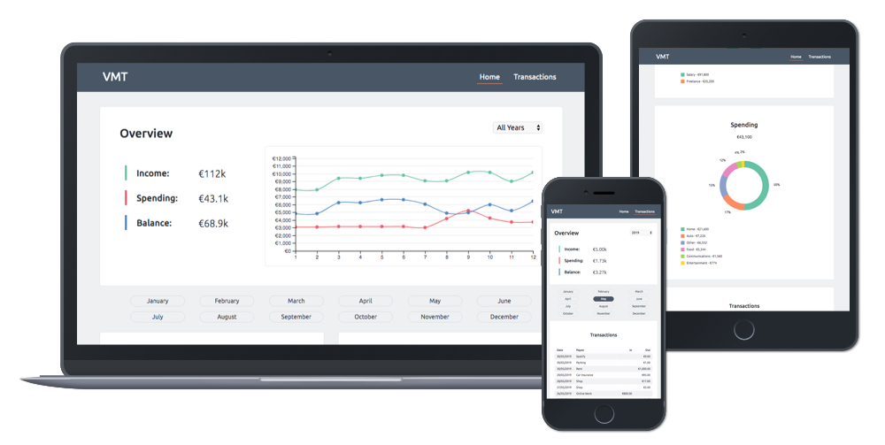

# Visual Money Tracker

A data dashboard application to visualise personal income and spending.

[Live Preview](https://elastic-hawking-05c821.netlify.com/)

## UX

An overview data dashboard with charts and list of transactions to visualise and track the money flow.

To learn more about the needs of the user, please read the [Project Brief](ux/Project_Brief.md) document.

#### Objectives

- Display a breakdown of totals
- Compare income vs spending
- Sort the transactions
- Calculate and display the balance

### Users

- Personal user

### Stories

Check out the [User Stories](ux/User_Stories.md) for this project.

## Features

- **New** - Line Compare feature

- Import CSV import via API
- Format the data
- Output data as a table
- Visual chart for income categories
- Visual chart for spending categories
- Data filtering by year, month, type and category
- Multiple month selection
- Responsive UI

_Features to be implemented in the future:_

- View an individual transaction
- Add new transaction
- Edit current transaction

## Structure

_The Mindmap_

## Skeleton

#### Wireframes

_Home view_

_Transactions view_

## Surface

#### Fonts

- Ubuntu - https://fonts.google.com/specimen/Ubuntu (Primary font)

#### Colours

#### Design Mockups

_Small:_ [Home](ux/Designs/Small/Home.png), [Transactions](ux/Designs/Small/Transactions.png)

_Medium:_ [Home](ux/Designs/Medium/Home.png), [Transactions](ux/Designs/Medium/Transactions.png)

_Large:_ [Home](ux/Designs/Large/Home.png), [Transactions](ux/Designs/Large/Transactions.png)

## Tech

A list of all of the languages, frameworks and libraries used to construct this project.

- JavaScript, HTML & CSS
- D3.js API - https://d3js.org/
  - Import transactions from CVS file.
- DC.js library - https://dc-js.github.io/dc.js/
  - Composite chart
  - Pie chart
  - Table view
  - Number display
  - Select menu
  - Checkbox
- Crossfilter.js library - https://github.com/crossfilter/crossfilter
  - Dimensions and filtering
- SVG
  - Draw the charts using dynamic data
- Jasmine - https://jasmine.github.io/
  - Test Driven Development (TDD)
- Bootstrap CSS - https://getbootstrap.com
  - Grid - for application layout
  - Buttons - for navigation
- Google Fonts - https://fonts.google.com
  - Support non-standard fonts in user browser
- Prettier - https://prettier.io
  - Code clean up

## Testing

### UX

User needs checklist:

- [x] User can select a year and see the income for that year.
- [x] User can select a year and see the spending for that year.
- [x] User can select a year and see the balance for that year.
- [x] User can see a dynamic chart that updates based on the selection.
- [x] User can select multiple months and see the income for those months.
- [x] User can select multiple months and see the spending for those months.
- [x] User can select multiple months and know the balance for those months.
- [x] User can choose a category and see the income for that category.
- [x] User can choose a category and see the spending for that category.
- [x] User can see list of transactions and filter them by year, month, type or category.

### TDD

- [x] Check if the table contains the correct amount of columns.
- [x] Check for proper column names.
- [x] Check if month names are correct.
- [x] Check if month names have the correct data type.

Check out the [Jasmine Results](https://elastic-hawking-05c821.netlify.com/tests.html)

### Code

The application was checked with W3C [HTML](https://validator.w3.org/nu/?doc=https%3A%2F%2Felastic-hawking-05c821.netlify.com%2F) and [CSS](https://jigsaw.w3.org/css-validator/validator?uri=https%3A%2F%2Felastic-hawking-05c821.netlify.com%2Fassets%2Fstyles%2Fapp.css&profile=css3svg&usermedium=all&warning=1&vextwarning=&lang=en) validators, and the issues where fixed accordingly.

### Browsers

Tested on the following browsers:

**Physical devices**

- Chrome 75 / MacOS High Sierra 10 / iMac
- Firefox 66 / MacOS High Sierra 10 / iMac
- Safari 12 / MacOS High Sierra 10 / iMac
- Chrome 70 / Linux Mint 19 / Asus Notebook
- Chrome 76 / iOS 12/ iPhone 6s
- Safari 12 / iOS 12 / iPhone 6s

## Deployment

The application is deployed to Netlify. To see a working version please go to: [Live Preview](https://elastic-hawking-05c821.netlify.com/).

To run the project locally, you do not need any additional software.

The application can be deployed to any static application hosting provider.

I am using Netlify because it can automatically deploy the application each time I push my commits to GitHub repository.

To deploy the application to [Netlify](https://www.netlify.com/), you need to sign up for an account first. Choose the 'New site from Git' option, then pick your online git hosting service provider and grant permission to access your repository. And it's done! Now each time you commit to GitHub or your preferred service, Netlify will automatically deploy the application.

#### Acknowledgements

A tool to create data structure and generate a CSV file:

- https://mockaroo.com/

Useful resources:

- https://www.tutorialspoint.com/dcjs
- https://dc-js.github.io/dc.js/examples/