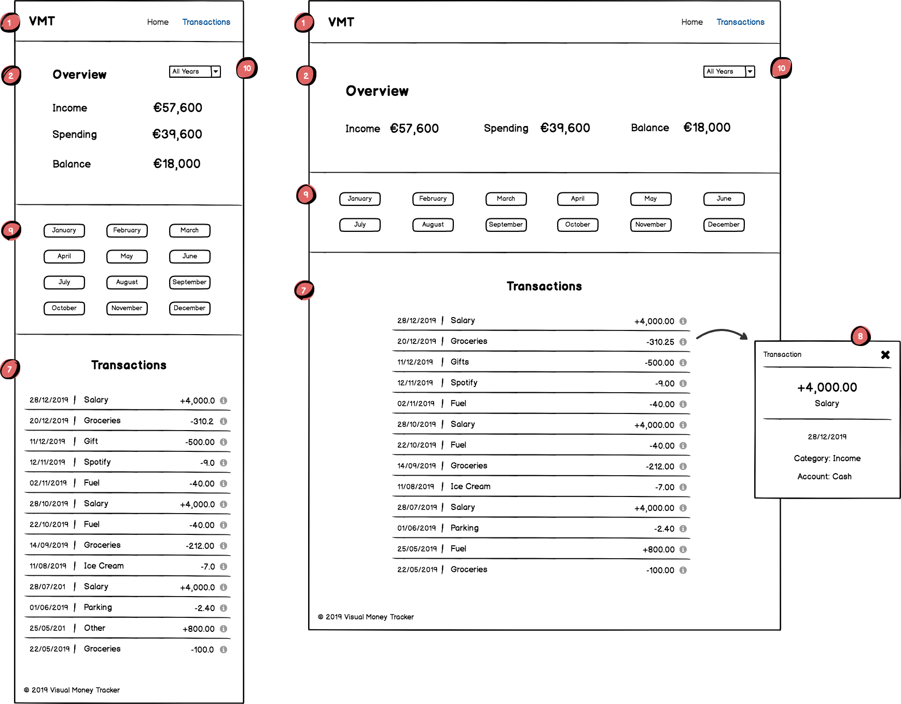

# Visual Money Tracker

A data dashboard with transactions overview and D3.js charts. 

## UX

Data visualisation using D3 charts for income and spending.

To learn more about the needs of user, please read the [Project Brief](ux/Project_Brief.md) document.

#### Objectives

- See better overview of personal finances
- Increase money saving
- Reduce money spending

### Users

- Personal user

### Stories

**_"As a user, I want to view my transactions overview, so that, I can see my income, spending and balance."_**

- As a user, I want to view my income summary, so that, I can see how much I earned.
  - [ ] Calculated a total income for 12 months and display the value in 'Overview' section.
- As a user, I want to view my expanses summary, so that, I can see how much I spend.
  - [ ] Calculated a total expenses for 12 months and display the value in 'Overview' section.
- As a user, I want to view my balance, so that, I can see how much I have.
  - [ ] Calculated a total balance for 12 months and display the value in 'Overview' section.

## Features

- Data visualisation with D3.js and DC.Js
- Single Page Application
- Mobile optimised
- Overview
- Table list
- Line chart
- Pie chart

_Features to be implemented in the future:_

- Add new transaction
- Edit current transaction

## Structure

<u>*The Mindmap*</u>

## Skeleton

#### Wireframes

<u>*Dashboard view*</u>

<u>*Transactions view*</u>

## Surface

#### Fonts

...

#### Colours

...

#### Design Mockups

...

## Tech

A list of all of the languages, frameworks and libraries used to construct this project.

- HTML & CSS
- Bootstrap CSS - https://getbootstrap.com
- Google Fonts - https://fonts.google.com
  - Support non-standard fonts on user browser
- Prettier - https://prettier.io
  - Clean up code formatting

## Testing

### UX

The user needs checklist:

- [ ] User is able to see a numeric data overview of the transactions for 12 months.
- [ ] User is able to see the list of transactions and filter them by category.
- [ ] User is able to see a line chart for 12 month transactions

### Code

...

### Browsers

...

## Deployment

...

## Credits

#### Media

...

#### Acknowledgements

...
